# 第一章     需求分析

GoTE行程分享平台小程序的总目标是：在腾讯的开发平台上，利用现有的小程序开发平台，开发一个简洁的，易用的，为学生群体提供实时的行程信息，促进学生共同出行，增强外出安全，降低出行成本，节约城市出行空间或降低城市空车率。

 

大学生是一个低收入的群体，经济来源一般来自生活费、兼职工资，而在日常消费中出行又是一项不可避免的开支。在一些地理位置比较偏僻的学校，出行费用更加昂贵，安全性也更加堪忧。

GoTE的定位就是面向在校大学生提供一个分享出行信息的平台，是一个具备浏览、发布、预约、查看和管理出行信息的小程序，核心功能就是围绕着聚合零散的出行信息，让大学生可以在更多的情况下，避免独自出行,并且降低出行成本。

用户可以在出行之前发布自己的行程信息，何时从哪到哪，然后等待相同或相近目的地的人加入行程。

目前市面上发布行程的平台有很多，但面向在校大学生的同类平台展示没有。在这点上GoTE很有先发优势。

# 第二章     概要设计

### 功能模块的层次结构：

   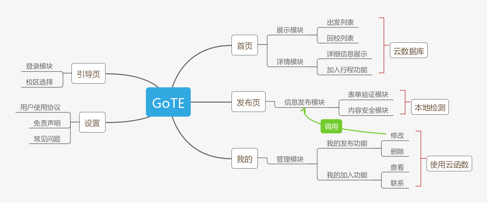

### 使用流程：

   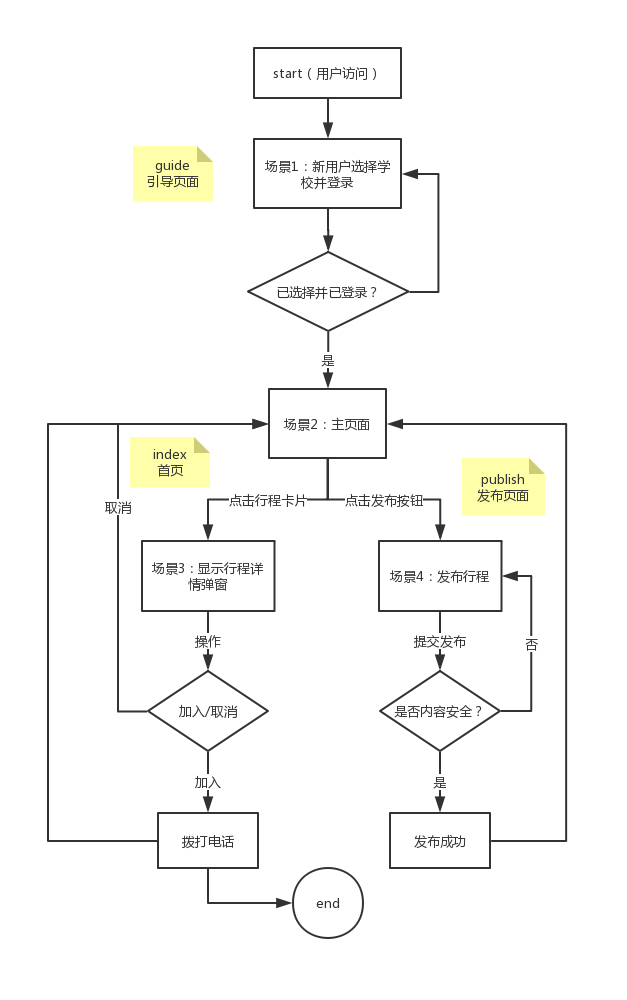

# 第三章     详细设计

### 界面设计：

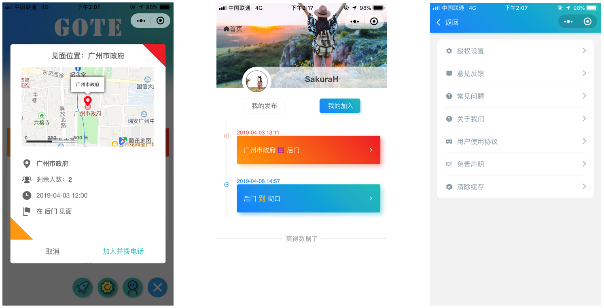

* GoTE是以学校为据点，将行程分为出发和回校两大。这里采用两个差别较大的色系，以便用户区分哪些是从学校出发，哪些是返回学校.
* 为了界面的简洁，行程卡片上只放置少量关键信息，点击卡片出现弹窗显示该行程的所有具体信息。
* 用户可以修改/删除自己发布过的信息，也可以查看自己加入的行程或再次联系行程发起人。

### 数据库设计：

 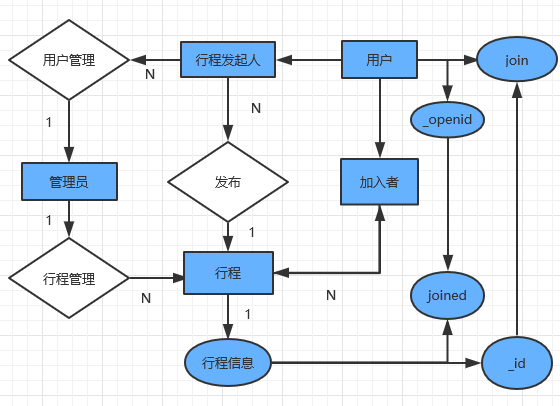    

 

* 在数据库表的设计中，采用小程序云开发中的对象型云数据库。
* 一个学校一个集合，该学校里的所有行程都存储在对应学校的集合中。
* 每个行程记录中记录下加入者的openid到joined字段中。
* 同时加入者也会将行程的_id增加到user集合的用户记录中的join字段。
* 用户和行程之间是多对多关系。

 

### 关键算法：

​    内容安全算法采用敏感词库，将用户输入的内容传进过滤算法中，如果内容中包含敏感词库的任一个词，则返回false，验证不通过。

​     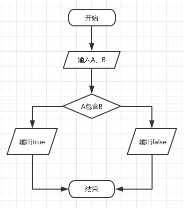

# 第四章     测试报告

测试背景：GoTE小程序是为一个为高校学生寻求拼车的平台。

测试对象：GoTE小程序开发版beta3。

测试环境：系统版本：window10

CPU 配置: AMD Ryzen 5 2500U @2.00 GHZ，

内存配置：8GB

微信web开发者工具1.02.1904090

测试目的：确保测试的功能正常，保证作品质量。

测试内容：功能测试，正确性测试，程序代码检查。

测试完成日期：2019年4月18日。

参考资料：小程序指南         <https://developers.weixin.qq.com/miniprogram/dev/index.html> 

 

### 测试过程：

| 测试种类 | 测试内容 | 结果  |
| ---- | ---- | ---- |
|  功能测试    |   多画面之间切换正确   |   通过   |
|      |   功能键，触发键，按钮，菜单，选择项功能     |   通过   |
|      |   数据项关联及限制功能正确     |   通过   |
|  正确性测试    |   读/写/删除操作结果正确     |   通过   |
|      |   各种组合条件之查询或报表正确   |   通过   |
|  程序代码测试    |   程序代码中有足够的说明信息   |   通过   |
|      |   函数头部应进行注释，列出函数的目的/功能等      |   通过   |
|      |   标识符使用完整的单词或大家基本可以理解的缩写      |   通过   |

### 实机测试：

   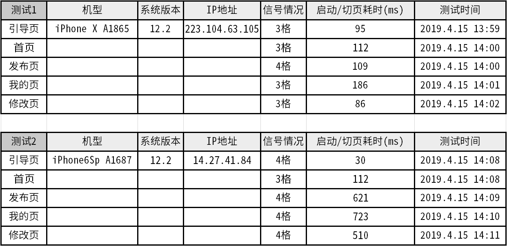

### 技术指标：

​      1、安全性：由于小程序不允许跳转到外部网站，不允许相互之间跳转，安全性得到了保障。

​      2、部署方便性：微信云开发为开发者提供完整的云端支持，无需搭建服务器，即可实现快速上线和迭代。

​      3、可用性：小程序为微信内置程序，在微信内即可打开

# 第五章     安装及使用

### 安装过程：

1. 请安装微信web开发者工具，可于[微信官网](https://developers.weixin.qq.com/miniprogram/dev/devtools/download.html)下载，建议下载：稳定版[Stable Build](https://developers.weixin.qq.com/miniprogram/dev/devtools/stable.html) (1.02.1902010)。下载地址：<https://developers.weixin.qq.com/miniprogram/dev/devtools/download.html
2. 安装后请使用微信登录 -> 选择小程序 -> 导入项目（项目根目录为GoTE _v1.1，若无自动填充AppID，可使用测试号）

   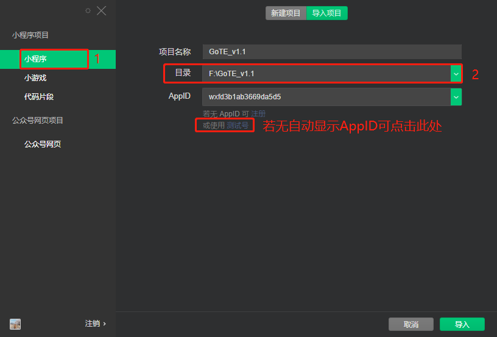

3. 进入编辑界面后请点击右上角“详情”按钮，选择调试基础库为 **2.6.5**   

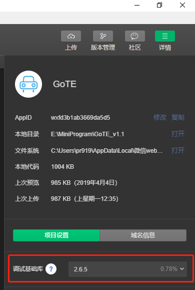

如登录后进入首页无任何数据时：

1. 可尝试点击工具栏左边的云开发按钮

   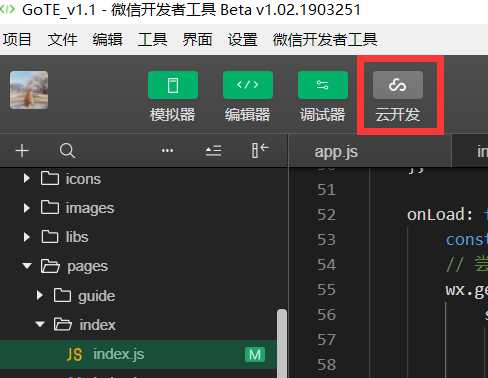

在数据库中添加两个集合，集合名字分别为 **gzHuaXia**  和 **user**

然后依次将02素材与源码 目录下的 **gzHuaXia.json** 和 **user.json** 导入到集合中，并将

* gzHuaXia集合的权限设置为 **所有用户可读，仅创建者及管理员可写**

* user 集合的权限设置为 **仅创建者及管理员可读写**

2. 可尝试自行发布：依次点击右下角【蓝色+号按钮】   ，最左边的【火箭按钮】   ，点击后跳转至发布页面。填写相应信息后点击最底下的【飞机按钮】即可提交。

### 典型使用流程：

完成上述操作之后，即可选择普通编译模式，点击编译按钮进行编译。

1. 首次编译之后会跳转至guide 引导页，请选择学校并进行登录。登录成功后点击Go按钮即可跳转到首页。

2. 点击行程卡片即可在弹窗中查看详细信息，点击弹窗的底部右边的【加入按钮】即可加入行程。

3. 点击页面右下角的【蓝色+号按钮】   ，在弹出的按钮组中点击最左边火箭图案的【发布按钮】   ，即可进入发布页面进行发布信息。

4. 点击按钮组中最右边的小人图案的【我的按钮】   ，即可进入“我的”页面查看和管理已发布/加入的行程。

5. 点击按钮组中中间的齿轮图案的【设置按钮】   ，即可进入设置页面。

6. 在“我的”页面中，点击发布的行程可进行编辑或删除操作。 

    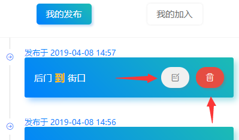

7. 在“我的”页面中，点击“我的加入”选项，点击加入的行程可查看行程详情或联系行程发起人。

    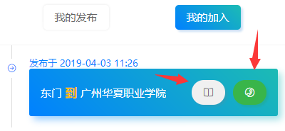

 

# 第六章     项目总结

开发中得益于小程序开发平台和云开发技术，使得项目不需管理后端即可完成所有需求。相比于测试版：

* 在设计上和代码规范方面有了很大提升，但依然有不小的提升空间。

* 在代码方面耦合稍高，代码复用率低，没有充分利用JavaScript的特性提示代码质量。

* 在功能上由于容易被用户误以为是拼车小程序只能暂时取消预估打车费用功能和出行方式选择。

云开发中的云数据库和云函数非常的方便，仅仅作为存储简单数据已经足够。但由于云开发技术尚未足够成熟，一些数据库操作并未提供，使得无法对数据进行复杂操作。如联表查询，操作多表。

在项目协调方面，团队小，分工明确，意见容易统一，借助云开发，使得产出速度较快。

 